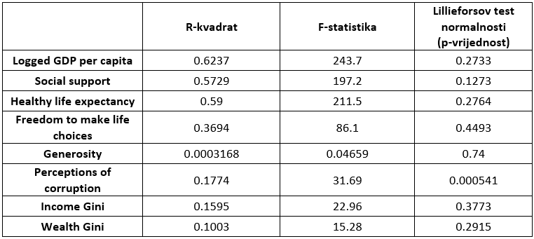

```{r setup, include=FALSE}
knitr::opts_chunk$set(echo = TRUE)
```


# Opis
Podaci kojima se bavimo u ovom projektu su dobiveni kroz ankete koje provode Gallup i Lloyd’s
Register Foundation. Proučavat ćemo podatke iz 2020. godine koji su sadžani u 9 varijabli te podatke iz 2021. godine koji su sadržani u 11 varijabli. Temeljna varijabla je osjećaj sreće prema Cantrilovoj ljestvici gdje su ispitanici ocjenjivali zadovoljstvo vlastitog života na skali od 0 do 10. Vrijednost varijable je prosjek reprezentativnog uzorka pojedine zemlje. Uz to podaci sadrže varijable kao što su BDP po stanovniku, životni vijek, socijalna podrška, percepcija korupcije, doniranje novca u dobrotvorne svrhe, nejednakost dohotka i slično.

```{r }
# Učitavanje podataka iz csv datoteke:
whr2020 = read.table("WHR_2020.csv", sep = ",")
whr2021 = read.table("WHR_2021.csv", sep = ",")
dim(whr2020)
dim(whr2021)
```
Summary podataka:
```{r, echo=FALSE}
print("2020: ")
summary(whr2020[3:9])
print("2021: ")
summary(whr2021[3:9])
```
<!--promjena imena stupaca-->
```{r, echo=FALSE}
colnames(whr2020) <- c("Country name", "Regional indicator", "Ladder score", "Logged GDP per capita", "Social support", "Healthy life expectancy", "Freedom to make life choices", "Generosity", "Perceptions of corruption") 

colnames(whr2021) <- c("Country name", "Regional indicator", "Ladder score", "Logged GDP per capita", "Social support", "Healthy life expectancy", "Freedom to make life choices", "Generosity", "Perceptions of corruption", "Income Gini", "Wealth Gini") 
```

``` {r}
names(whr2020)
names(whr2021)
```
# Deskriptivna statistika
Prikažimo sada histograme usporedbe varijabli za različite godine.
```{r}
#histogrami varijable s obzirom na godine
plot_by_years <- function(column, main) {
  hist(whr2021[[column]], breaks=15, main=main, xlab=column, ylab="Frequency",col=rgb(0,0,1,0.5))
  hist(whr2020[[column]], breaks=15, main=main, xlab=column, ylab="Frequency", col=rgb(1,0,0,0.5), add=T)
  legend(x="topright", c("2020", "2021"), col=c(rgb(1,0,0,0.5),
                                                rgb(0,0,1,0.5)), pt.cex = 2, pch = 15)
}
plot_by_years("Ladder score", "Ladder score histogram") 
plot_by_years("Logged GDP per capita", "Logged GDP per capita histogram")
plot_by_years("Social support", "Social support histogram")
plot_by_years("Healthy life expectancy", "Healthy life expectancy histogram")
plot_by_years("Freedom to make life choices", "Freedom to make life choices histogram")
plot_by_years("Generosity", "Generosity histogram")
plot_by_years("Perceptions of corruption", "Perceptions of corruption histogram")
hist(whr2021$`Income Gini`, breaks=10, main="Income Gini 2021", xlab="Income Gini", ylab="Frequency",col=rgb(0,0,1,0.5))
hist(whr2021$`Wealth Gini`, breaks=10, main="Wealth Gini 2021", xlab="Wealth Gini", ylab="Frequency",col=rgb(0,0,1,0.5))
```
Iz dobivenih histograma vidljivo je da postoje promjene u varijablama za različite godine, no raspodjela podataka je veoma slična za obje godine.
Također se može naslutiti da većina podataka nije normalno distribuirana.

Izračunajmo srednje vrijednosti i medijane Ladder score-ova po regijama.
```{r}
library(tidyverse)

whr2021 %>% group_by(`Regional indicator`) %>% summarise(
          Mean.LadderScore = mean(`Ladder score`),
          Mean.GDP = mean(`Logged GDP per capita`),
          Mean.SocialSupport = mean(`Social support`),
          Mean.LifeExp = mean(`Healthy life expectancy`),
          Mean.Freedom = mean(`Freedom to make life choices`),
          Mean.Generosity = mean(Generosity),
          Mean.Corruption = mean(`Perceptions of corruption`),
          Len = length(`Ladder score`)
           #Mean.IncomeGini = mean(`Income Gini`),
           #Mean.WealthGini = mean(`Wealth Gini`)
            ) -> summary.result1
summary.result1


whr2021 %>% group_by(`Regional indicator`) %>% summarise(
          Med.LadderScore = median(`Ladder score`),
          Med.GDP = median(`Logged GDP per capita`),
          Med.SocialSupport = median(`Social support`),
          Med.LifeExp = median(`Healthy life expectancy`),
          Med.Freedom = median(`Freedom to make life choices`),
          Med.Generosity = median(Generosity),
          Med.Corruption = median(`Perceptions of corruption`)
            ) -> summary.result2
summary.result2
```
Promatrajući varijable u 2021. godini vidimo da su vrijednosti podataka u svim varijablama (osim kod varijable za percepciju korupcije") veće za Zapadnu Europu u usporedbi s Centralnom i Istočnom Europom.

# Povezanost između Ladder score i Logged GDP per capita
Možemo li iz dijagrama raspršenja možda naslutiti kakvu vezu između Ladder score i GDP per capita?
Posebno ćemo istaknuti 3 regije na dijagramu (Zapadnu Europu, Srednju i Istočnu Europu i Sub-Saharsku Afriku).

```{r}
#trebalo bi i ispitat jesu li reziduali iz normalne
ce_europe = whr2021[whr2021$`Regional indicator` == "Central and Eastern Europe",]
w_europe = whr2021[whr2021$`Regional indicator` == "Western Europe",]
europe <- rbind(ce_europe, w_europe)

fitGDPWestEast = lm(europe$`Ladder score` ~ europe$`Logged GDP per capita`)

# Razlikujemo vrste regija:
plot(whr2021$`Ladder score`[whr2021$`Regional indicator`=='Central and Eastern Europe'],
     whr2021$`Logged GDP per capita`[whr2021$`Regional indicator`=='Central and Eastern Europe'],
     col='blue',
     xlim=c(min(whr2021$`Ladder score`),max(whr2021$`Ladder score`)),
     ylim=c(min(whr2021$`Logged GDP per capita`),max(whr2021$`Logged GDP per capita`)),
     xlab='Ladder score',
     ylab='Logged GDP per capita')

points(whr2021$`Ladder score`[whr2021$`Regional indicator`=='Western Europe'],
     whr2021$`Logged GDP per capita`[whr2021$`Regional indicator`=='Western Europe'],col='red')
lines(fitGDPWestEast$fitted.values, europe$`Logged GDP per capita`)
summary(fitGDPWestEast)

```
Iz dijagrama raspršenja vidljiva je moguća povezanosti Ladder score s GDP per capita. Linearnom regresijom potvrđujemo povezanost između varijabli Logged GDP per capita i Ladder score zbog značajnog R-squared i testova o koeficijentima $\beta_0$ i $\beta_1$. Također vidimo da se na dijagramu razlikuju vrijednosti Zapadne i Srednje i Istočne Europe.

## Jesu li ljudi u Zapadnoj Europi sretniji od ljudi u Srednjoj i Istočnoj Europi?
```{r}
western_europe = whr2021[whr2021$`Regional indicator` == "Western Europe",]
central_eastern_europe = whr2021[whr2021$`Regional indicator` == "Central and Eastern Europe",]
```

```{r}
cat('Prosječan Ladder score zemalja iz Zapadne Europe ', mean(western_europe$`Ladder score`),'\n')
cat('Prosječan Ladder score zemalja iz Srednje i Istočne Europe', mean(central_eastern_europe$`Ladder score`), '\n')
```
Histogrami za za Zapadnu i Centralnu/Istočnu Europu:
```{r}
h = hist(western_europe$`Ladder score`,
         main="Ladder score Western Europe",
         xlab="Ladder score",
         ylab='Frequency',
         col="blue",
         breaks = 20
         )

h = hist(central_eastern_europe$`Ladder score`,
         main="Ladder score Central and Eastern Europe",
         xlab="Ladder score",
         ylab='Frequency',
         col="blue",
         breaks = 20
         )
```
Pravokutni dijagram za Zapadnu i Centralnu/Istočnu Europu:
```{r}
boxplot(western_europe$`Ladder score`,central_eastern_europe$`Ladder score`,
        main='Ladder score box-plot',
        ylab='Ladder score', xlab="Regional indicator", names = c("Western Europe", "Central and Eastern Europe"))
```
Postoje indikacije da bi ljudi iz zemalja Zapadne Europe trebali biti sretniji od ljudi iz zemalja Srednje i Istočne Europe.

Postavimo sljedeće hipoteze: \
$H_0$: Ladder score je jednak za Zapadnu i Srednju i Istočnu Europu \
$H_1$: Ladder score je veći u Zapadnoj Europi od onog u Srednjoj i Istočnoj Europi

Ovakvo ispitivanje možemo provesti t-testom. Kako bi mogli provesti test, moramo najprije provjeriti pretpostavke normalnosti i nezavisnosti uzorka. Obzirom da razmatramo dva uzoraka iz dvije različite regije, možemo pretpostaviti njihovu nezavisnost. Sljedeći korak je provjeriti normalnost podataka koju ćemo provjeriti qq-plotom i KS testom.
```{r}
qqnorm(western_europe$`Ladder score`, pch = 1, frame = FALSE,main='Western Europe')
qqline(western_europe$`Ladder score`, col = "steelblue", lwd = 2)

qqnorm(central_eastern_europe$`Ladder score`, pch = 1, frame = FALSE,main='Central and Eastern Europe')
qqline(central_eastern_europe$`Ladder score`, col = "steelblue", lwd = 2)
```
Koristimo Lillieforsovu inačicu testa normalnosti jer srednju vrijednost i varijancu računamo iz uzorka.
```{r}
library(nortest)
lillie.test(western_europe$`Ladder score`)
lillie.test(central_eastern_europe$`Ladder score`)
```
Iz qq-plota ne možemo zaključiti normalnost podataka. Velika p-vrijednost kod Lillieforsovog testa govori kako ne možemo odbaciti hipotezu da podaci dolaze iz normalne distribucije.

Pogledajmo vrijednost varijanci oba uzorka.
```{r}
var(western_europe$`Ladder score`)
var(central_eastern_europe$`Ladder score`)
#Jesu li varijance značajno različite
var.test(western_europe$`Ladder score`, central_eastern_europe$`Ladder score`)
```

p-vrijednost od 0.2498 nam govori da ne odbacujemo hipotezu da su varijance uzoraka jednake.

Provedimo sada t-test uz pretpostavku jednakosti varijanci.

```{r}
t.test(western_europe$`Ladder score`, central_eastern_europe$`Ladder score`, alt = "greater", var.equal = TRUE)

```
Zbog male p-vrijednosti možemo odbaciti hipotezu $H_0$ u korist alternative da je Ladder score veći u Zapadnoj Europi od onog u Srednjoj i Istočnoj Europi.

# Povezanost između Logged GDP per capita i Gini koeficijenata

Pogledajmo distribuciju prirodnog logaritma bruto domaćeg proizvoda po stanovniku prema paritetu kupovne moći za nejednakost dohotka i nejednakost bogatstva.
```{r}
plot(whr2021$`Logged GDP per capita`, whr2021$`Income Gini`, xlab = "Logged GDP per capita", ylab = "Income Gini",
     main = "Distribucija log(BDP) u ovisnosti o nejednakosti dohotka")
plot(whr2021$`Logged GDP per capita`, whr2021$`Wealth Gini`, xlab = "Logged GDP per capita", ylab = "Wealth Gini",
     main = "Distribucija log(BDP) u ovisnosti o nejednakosti bogatstva")
```
Iz grafova vidimo da podaci ne slijede lijepi linerarni trend te bi mogli pretpostaviti da ne postoji značajna zavisnost između prirodnog logaritma bruto domaćeg proizvoda po stanovniku s nejednakostima dohotka i bogatstva.

Izračunajmo sada srednje vrijednosti i medijane za nejednokost bogatstva po regijama:
```{r}
library(tidyverse)

whr2021 %>% group_by(`Regional indicator`) %>% summarise(
          Mean.WealthGini = mean(`Wealth Gini`),
          Median.WealthGini = median(`Wealth Gini`)
            ) -> summary.WealthGiniRegion
summary.WealthGiniRegion
```
!Primjećujemo da nedostaju podaci za neke države te zbog toga nisu prikazani rezultati za sve regije.!

Najveća razlika srednje vrijednosti i medijana vidljiva je između Istočne Azije i Jugoistočne Azije. Postoje indikacije da je nejednakost bogatstva veća u Jugoistočnoj Aziji u odnosu na Istočnu Aziju.

##Nejednakost bogatstva Istočna Azija vs Jugoistočna Azija
Postavimo sljedeće hipoteze:
H_0: Nejednakost bogatstva je jednaka u Istočnoj i Jugoistočnoj Aziji
H_1: Nejednakost bogatstva je veća u Jugoistočnoj Aziji u odnosu na Istočnu Aziju

Ovakvo ispitivanje možemo provesti t-testom. Kako bi mogli provesti test, moramo najprije provjeriti pretpostavke normalnosti i nezavisnosti uzorka. Obzirom da razmatramo uzorke država različitih regija, možemo pretpostaviti njihovu nezavisnost. Sljedeći korak je provjeriti normalnost podataka koju ćemo provjeriti qq-plotom i Lillieforsovim testom.
```{r}
library(nortest)
southeast_asia = whr2021[whr2021$`Regional indicator` == "Southeast Asia",]
east_asia = whr2021[whr2021$`Regional indicator` == "East Asia",]

qqnorm(east_asia$`Wealth Gini`, pch = 1, frame = FALSE,main='Wealth Gini - East Asia')
qqline(east_asia$`Wealth Gini`, col = "steelblue", lwd = 2)
qqnorm(southeast_asia$`Wealth Gini`, pch = 1, frame = FALSE,main='Wealth Gini - Southeast Asia')
qqline(southeast_asia$`Wealth Gini`, col = "steelblue", lwd = 2)
lillie.test(east_asia$`Wealth Gini`)
lillie.test(southeast_asia$`Wealth Gini`)
```
Iz qq-plota ne možemo pretpostaviti normalnost podataka. Velika p-vrijednost kod Lillieforsovog testa govori kako ne možemo odbaciti hipotezu da podaci dolaze iz normalne distribucije.

Pogledajmo vrijednost varijanci oba uzorka.
```{r}
var(east_asia$`Wealth Gini`)
var(southeast_asia$`Wealth Gini`)
#Jesu li varijance značajno različite
var.test(east_asia$`Wealth Gini`, southeast_asia$`Wealth Gini`)
```
p-vrijednost od 0.3381 nam govori da ne odbacujemo hipotezu da su varijance uzoraka jednake.

Provedimo sada t-test uz pretpostavku jednakosti varijanci.
```{r}
t.test(southeast_asia$`Wealth Gini`, east_asia$`Wealth Gini`, alt = "greater", var.equal = TRUE)

```
Zbog male p-vrijednosti možemo odbaciti hipotezu H_0 u korist alternative da je nejednakost bogatstva u Jugoistočnoj Aziji u prosjeku veća od nejednakosti bogatstva u Istočnoj Aziji.

# Zastupljenost korupcije u zemljama Europe i Afrike

Pokušajmo sada zaključiti nešto o korupciji. Promatrat ćemo zemlje Europe i Afrike te želimo saznati gdje je korupcija zastupljenija. Ispitat ćemo zavisnost percepcije korupcije o logaritmu BDP-a po stanovniku. 
```{r}
ce_europe = whr2021[whr2021$`Regional indicator` == "Central and Eastern Europe",]
w_europe = whr2021[whr2021$`Regional indicator` == "Western Europe",]
europe <- rbind(ce_europe, w_europe)
men_africa = whr2021[whr2021$`Regional indicator` == "Middle East and North Africa",]
ss_africa = whr2021[whr2021$`Regional indicator` == "Sub-Saharan Africa",]
africa <- rbind(men_africa, ss_africa)


plot_by_gini <- function(column, main) {
  hist(europe[[column]], breaks=30, main=main, xlab=column, ylab="Frequency", ylim = c(0,8),col=rgb(0,0,1,0.5))
  hist(africa[[column]], breaks=30, main=main, xlab=column, ylab="Frequency", col=rgb(1,0,0,0.5), add=T)
  legend(x="topright", c("Africa", "Europe"), col=c(rgb(1,0,0,0.5), rgb(0,0,1,0.5)), pt.cex = 2, pch = 15)
}
plot_by_gini("Perceptions of corruption", "Perceptions of corruption histogram")
plot(africa$`Perceptions of corruption`,
     africa$`Logged GDP per capita`,
     col='blue',
     ylab='Logged GDP per capita',
     xlab='Perceptions of corruption')
points(europe$`Perceptions of corruption`,
     europe$`Logged GDP per capita`,col='red')
boxplot(africa$`Perceptions of corruption`,europe$`Perceptions of corruption`,
        main='Perceptions of corruption box-plot',
        ylab='Perceptions of corruption', xlab="Regional indicator", names = c("Africa", "Europe"))
```
Iz histograma vidimo da je percepcija korupcije u Africi bitno veća nego u Europi. Iz drugog grafa vidimo da je logaritam BDP-a po stanovniku relativno visok za sve države Europe te neovisno o njemu ljudi različito percipiraju korupciju. Za države Afrike prevladava visok stupanj percepcije korupcije neovisno o BDP-u. Iz box-plota vidimo veliki rang podataka za Europu, no medijan je otprilike jednak za oba kontinenta.
Izračunajmo sada srednju vrijednost percepcije korupcije za Europu i Afriku.
```{r}
mean_europe = mean(europe$`Perceptions of corruption`)
mean_africa = mean(africa$`Perceptions of corruption`)
print(mean_europe)
print(mean_africa)
```
## Možemo li na temelju analiza zaključiti da je percepcija korupcije manja u Europi?

Postavimo hipoteze:
H_0: srednja vrijednost percepcije korupcije za Europu i Afriku je jednaka
H_1: srednja vrijednost percepcije korupcije za Europu je manja od srednje vrijednosti za Afriku
Ovakvo ispitivanje možemo provesti t-testom. Kako bi mogli provesti test, moramo najprije provjeriti pretpostavke normalnosti i nezavisnosti uzorka. Obzirom da razmatramo uzorke država različitih kontinenta, možemo pretpostaviti njihovu nezavisnost. Sljedeći korak je provjeriti normalnost podataka koju ćemo provjeriti qq-plotom.
```{r}
qqnorm(europe$`Perceptions of corruption`, pch = 1, frame = FALSE,main='Perceptions of corruption - Europe')
qqline(europe$`Perceptions of corruption`, col = "steelblue", lwd = 2)

qqnorm(africa$`Perceptions of corruption`, pch = 1, frame = FALSE,main='Perceptions of corruption - Africa')
qqline(africa$`Perceptions of corruption`, col = "steelblue", lwd = 2)
```
Iz dobivenih grafova možemo naslutiti normalnost podataka za Afiku uz male izuzetke na repovima dok normalnost podataka za Europu nije vidljiva pa ne možemo provesti t-test. Već iz prethodnog histograma se dalo naslutiti da podaci za Europu ne slijede normalnu distibuciju.

Testirajmo li podatke Lillieforsovim testom dolazimo do istog zaključka.
```{r}
lillie.test(africa$`Perceptions of corruption`)
lillie.test(europe$`Perceptions of corruption`)
```
Zbog male p-vijednosti možemo odbaciti hiptezu H_0 da podaci dolaze iz normalne distibucije. Ne možemo provesti t-test. Jedan od mogućih rješenja je transformirati podatke i provesti jackknife.

# Usporedba razina sreće u 2020. i 2021. godini.

```{r}
library(ggplot2)
require(maps)

data2021 = whr2021[c("Country name", "Ladder score")]
names(data2021)[names(data2021) == "Country name"] = "region"

mapdata2021 = map_data("world")
mapdata2021 = left_join(mapdata2021, data2021, by = "region")

map2021 = ggplot(mapdata2021, aes(x = long, y = lat, group = group)) +
  geom_polygon(aes(fill = `Ladder score`), color = "black", size = 0.1) + theme(axis.text.x = element_blank(),
                           axis.text.y = element_blank(),
                           axis.ticks = element_blank(),
                           axis.title.y = element_blank(),
                           axis.title.x = element_blank(),
                           rect = element_blank())

map2021

```

Pravokutni dijagram Ladder score-ova za 2020. i 2021. godinu.

```{r, echo = FALSE}
boxplot(whr2020$`Ladder score`, whr2021$`Ladder score`,
        main = 'Ladder score box-plot by year',
        xlab = 'Year', ylab = 'Ladder score', names = c('2020', '2021'))
```


```{r, echo = FALSE}
c1 = rgb(173,216,230,max = 255, alpha = 80, names = "lt.blue")
c2 = rgb(255,192,203, max = 255, alpha = 80, names = "lt.pink")
ladder2020 = whr2020$`Ladder score`
ladder2021 = whr2021$`Ladder score`
hist1 = hist(ladder2020, breaks = 10, plot = FALSE)
hist2 = hist(ladder2021, breaks = 10, plot = FALSE)
plot(hist1, col = c1, main = "Histogram of ladder score for two years", xlab = "Ladder score")
plot(hist2, col = c2, add = TRUE)
legend("topright",
  legend=c('2020','2021'),
  fill = c(c1,c2)
)
```
Spojimo podatke iz dvije godine te na histogramu prikažimo razlike razina sreće za dvije godine.
```{r}
mergedData = merge(whr2020, whr2021, by="Country name", suffixes = c(".20",".21"))

hist(mergedData$`Ladder score.20`-mergedData$`Ladder score.21`,
     main=paste('Difference in ladder scores between two years'),
     xlab='Ladder score')

qqnorm(mergedData$`Ladder score.20`-mergedData$`Ladder score.21`, 
       pch = 1, 
       frame = FALSE, 
       main=paste('QQ-plot for differences between ladder scores'))
qqline(mergedData$`Ladder score.20`-mergedData$`Ladder score.21`, 
       col = "steelblue", lwd = 2)
```


Histogram razlika nam sugerira normalnost podataka, dok iz qq-plota vidimo malo odstupanje lijevog repa. 
Testiramo normalnost podataka o razlici razina sreće za dvije države. Koristimo Lillieforsovu inačicu KS testa.

```{r}
lillie.test(mergedData$`Ladder score.20`-mergedData$`Ladder score.21`)
```
Unatoč maloj p-vrijednosti Lillieforsovog testa, nastavljamo s testom o uparmin podacima, jer na razini značajnosti od 1% ipak ne možemo odbaciti hipotezu da podaci dolaze iz normalne razdiobe. Pod pretpostavkom da su podatci normalni, koristimo upareni t-test.
Postavljamo hipoteze: \
$H_0$: $\mu_{2020}$ = $\mu_{2021}$ 
$H_1$: $\mu_{2020}$ < $\mu_{2021}$

```{r}
t.test(mergedData$`Ladder score.20`, 
       mergedData$`Ladder score.21`, 
       paired = TRUE, 
       alt = "less")
```

Jako mala p-vrijednost nam ukazuje da postoji statistički značajna razlika u "ladder score-u" u dvije godine. Postoje značajne razlike u sreći država u dvije godine tj. države u 2021. godini su sretnije nego u 2020.

# Ovisnost razine sreće o drugim varijablama u 2021. godini

Možemo li iz dijagrama raspršenja naslutiti vezu između varijabli iz skupa podataka i Ladder score-a?

```{r, echo = FALSE}
fitGDP = lm(whr2021$`Ladder score` ~ whr2021$`Logged GDP per capita`)
fitHealth = lm(whr2021$`Ladder score` ~ whr2021$`Healthy life expectancy`)
fitSocialSupport = lm(whr2021$`Ladder score` ~ whr2021$`Social support`)
fitFreedom = lm(whr2021$`Ladder score` ~ whr2021$`Freedom to make life choices`)
fitGenerosity = lm(whr2021$`Ladder score` ~ whr2021$Generosity)
fitCorruption = lm(whr2021$`Ladder score` ~ whr2021$`Perceptions of corruption`)
fitIncomeGini = lm(whr2021$`Ladder score` ~ whr2021$`Income Gini`)
fitWealthGini = lm(whr2021$`Ladder score` ~ whr2021$`Wealth Gini`)

plot(whr2021$`Logged GDP per capita`, whr2021$`Ladder score`,
     col="blue",
     xlab='Logged GDP per capita',
     ylab='2021 Ladder score')
lines(whr2021$`Logged GDP per capita`, fitGDP$fitted.values)

plot(whr2021$`Healthy life expectancy`, whr2021$`Ladder score`,
     col="blue",
     xlab='Healthy life expectancy',
     ylab='2021 Ladder score')
lines(whr2021$`Healthy life expectancy`, fitHealth$fitted.values)

plot(whr2021$`Social support`, whr2021$`Ladder score`,
     col="blue",
     xlab='Social support',
     ylab='2021 Ladder score')
lines(whr2021$`Social support`, fitSocialSupport$fitted.values)

```
Iz dobivenih grafova bi mogli naslutiti da postoji veza između ulaznih varijabli i izlazne. Da bi nastavili daljnju analizu potrebno je provjeriti pretpostavke modela o regresorima i rezidualima. One ne smiju biti jako narušene. Mora vrijediti normalnost reziduala i homogenost varijance te regresori ne smiju biti jako korelirani kada imamo više regresora.
Provjerimo prvo normalnost reziduala i homogenost varijance.
```{r}
plot(fitGDP$residuals, main = "Rezudiali")

hist((fitGDP$residuals))
hist(rstandard(fitGDP))

qqnorm(rstandard(fitGDP))
qqline(rstandard(fitGDP))

require(nortest)
lillie.test(rstandard(fitGDP))

```
Iz samog prikaza reziduala, teško je doći do nekog zaključka o normalnosti. Histogrami nam prikazuju izgled distibucije reziduala te vidimo da distibucija donekle nalikuje normalnoj. Također, iz qq grafa možemo naslutiti normalnost reziduala. Velika p-vrijednost kod Lillieforsovog testa govori kako ne možemo odbaciti hipotezu da podaci dolaze iz normalne distribucije

Izračunajmo sada mjere za model jednostavne linearne regresije za ulaznu varijabu "Logged GDP per capita" i izlaznu varijabu "Ladder score".
```{r}
summary(fitGDP)
```
R-kvadrat (koeficijent determinacije) za dobiveni model iznosi 0.6237 što nam govori koliki postotak varijance u izlaznoj varijabli("Ladder score") je estimirani linearni model opisao.  F-statistika nam služi za ispitivanje signifikantnosti modela. 

Pogledajmo koliko iznose R-kvadrat i F-statistika za preostale jednostavne modele linearne regresije.
```{r include=FALSE}
summary(fitSocialSupport)
lillie.test(rstandard(fitSocialSupport))
summary(fitHealth)
lillie.test(rstandard(fitHealth))
summary(fitFreedom)
lillie.test(rstandard(fitFreedom))
summary(fitGenerosity)
lillie.test(rstandard(fitGenerosity))
summary(fitCorruption)
lillie.test(rstandard(fitCorruption))
summary(fitIncomeGini)
lillie.test(rstandard(fitIncomeGini))
summary(fitWealthGini)
lillie.test(rstandard(fitWealthGini))
```
```{r echo=FALSE}

```
Prema vrijednostima R-kvadrat i F-statistike kao tri najznačajnija regresora kod jednostruke regresije su redom "Logged GDP per capita", "Healthy life expectancy" i "Social support". Varijabla "Generosity" se pokazala kao najmanje značajna te ju vjeroatno ni nećemo koristiti u višestrukoj linearnoj regresiji.

Prije nego što krenemo s višestukom linearnom regresijom moramo provjeriti korelaciju među ulaznim varijablama.
```{r fig.width = 10, fig.height= 10, warning=FALSE, message=FALSE}
library("corrplot")
korelacija <- whr2021[,(names(whr2021) %in% c("Logged GDP per capita", "Social support", "Healthy life expectancy", "Freedom to make life choices", "Generosity", "Perceptions of corruption", "Income Gini", "Wealth Gini"))]
num <- cor(korelacija)
corrplot(num, method="number")
```
Varijabla "Logged GDP per capita" koja je u jednostavnoj linearnoj regresiji bila najznačajnija je jako korelirana s druge dvije najznačajnije ("Social support" i "Healthy life expectancy"). Zbog toga pri izgradnji modela višestruke linearne regresije ne smijemo koristiti sve 3 navedene varijable. Pokušajmo izgraditi model tako da R-kvadrat i F-statistika budu najveći. Primjetimo također da za Gini nedostaju neki podatci pa nam ova funkcija ne izračunava korelaciju.

Nadalje, probat ćemo iskoristiti i kategorijsku varijablu "Regional indicator", no prije moramo provjeriti:
- radi li se o varijabli na nominalnoj ili ordinalnoj skali,
- ima li varijabla linearan efekt na izlaznu varijablu,
- predstavlja li određena kategorijska varijabla nešto što je određenom metričkom varijablom već predstavljeno.

U slučaju varijable "Regional indicator", ona je na nominalnoj skali,te nije predstavljena nekom metričkom varijablom. Za provjeru linearanog efekta iskoristit ćemo box-plot.

```{r provjera linearnosti}
boxplot(`Ladder score`~`Regional indicator`,data=whr2021)
```
Iz priloženog box-plota ne vidimo neki linearan trend, te ćemo zasad zanemariti ovu varijablu.


```{r tražimo koje varijable najviše utječu na sreću}
fitAll= lm(`Ladder score` ~ `Logged GDP per capita` + `Social support` + `Healthy life expectancy` + `Freedom to make life choices` + `Generosity` + `Perceptions of corruption` + `Income Gini` + `Wealth Gini`, data = whr2021)
summary((fitAll))
```
Na temelju regresije sa svim varijablama, možemo zaključiti da Social support, Freedom to make life choices i Perception of corruption najviše djeluju na osjećaj sreće. Treba pronaći model koji opisuje veći postotak varijance, ali uz što manji broj regresora.
```{r}
fitm1= lm(`Ladder score` ~ `Social support`+`Freedom to make life choices` + `Perceptions of corruption`, data = whr2021)
summary((fitm1))

fitm2= lm(`Ladder score` ~ `Healthy life expectancy`+`Freedom to make life choices` + `Perceptions of corruption`, data = whr2021)
summary((fitm2))

fitm3= lm(`Ladder score` ~ `Logged GDP per capita`+`Freedom to make life choices` + `Perceptions of corruption`, data = whr2021)
summary((fitm3))

fitm4= lm(`Ladder score` ~ `Logged GDP per capita` + `Healthy life expectancy`+`Freedom to make life choices` + `Perceptions of corruption`, data = whr2021)
summary((fitm4))

fitm5= lm(`Ladder score` ~ `Logged GDP per capita` + `Social support`+`Freedom to make life choices` + `Perceptions of corruption`, data = whr2021)
summary((fitm5))

fitm6= lm(`Ladder score` ~ `Social support` + `Healthy life expectancy`+`Freedom to make life choices` + `Perceptions of corruption`, data = whr2021)
summary((fitm6))

fitm7= lm(`Ladder score` ~ `Logged GDP per capita`+`Social support` + `Healthy life expectancy`+`Freedom to make life choices` + `Perceptions of corruption`, data = whr2021)
summary((fitm7))
```
Iz priloženog vidimo, uključivši svih 5 značajnih varijabli dobivamo najveći R-squared. No, približno jednak rezultat dobivamo ako ne uključimo "Healthy life expectancy", što je posljedica koreliranosti između varijabli 
"Logged GDP per capita", "Social support" i "Healthy life expectancy". Također uočimo da u slučaju kada koristimo "Logged GDP per capita" i "Social support" u odnosu na "Logged GDP per capita" i "Healthy life expectancy" dobivamo bolji R-squared, dok je R-squared kod jednostavne regresije pojedinačnih varijabli veći u slučaju "Healthy life expectancy" nego "Social support". Razlog opet leži u većoj koreliranosti.

```{r smanjenje broja parametara}
fit1= lm(`Ladder score` ~ `Logged GDP per capita` + `Social support`+`Freedom to make life choices` + `Perceptions of corruption`, data = whr2021)
summary((fit1))

fit2= lm(`Ladder score` ~ `Logged GDP per capita` + `Social support`+`Freedom to make life choices` , data = whr2021)
summary((fit2))

fit3= lm(`Ladder score` ~ `Logged GDP per capita` + `Social support`+ `Perceptions of corruption`, data = whr2021)
summary((fit3))

fit4= lm(`Ladder score` ~ `Logged GDP per capita` + `Social support`, data = whr2021)
summary((fit4))
```

Iz ovoga proizlazi da originalan model ne možemo reducirati jer gubimo u R-squared. Konačan model se sastoji od "Logged GDP per capita", "Social support", "Freedom to make life choices" i "Perceptions of corruption".

Pokušajmo sada u model uvrstiti varijablu "Regional indicator"(iako nismo pronašli linearan trend) koja je kategorijska.
```{r}
fitm8 = lm(`Ladder score` ~ `Logged GDP per capita` + `Social support` + `Freedom to make life choices`+ `Regional indicator`, data=whr2021)
summary(fitm8)
```
Vidimo da R sam stvara tako zvane "dummy" varijable za kategorijsku varijablu "Regional indicator". Neke novo stvorene "dummy" varijable imaju veliku p-vrijednost što ukazuje da nisu značajne, no neke imaju malu p-vrijednost te se koeficijent determinacije povećao u usporedbi s ostalim modelima, ali se F-statistika smanjila.
Stvorimo sada sami dummy varijable da bih mogli u modelu koristiti samo najznačajnije.
```{r}
require(fastDummies)
whr2021.d = dummy_cols(whr2021,select_columns='Regional indicator')
```
```{r}
fitm9 = lm(`Ladder score` ~ `Logged GDP per capita` + `Social support` + `Freedom to make life choices`+ `Regional indicator_North America and ANZ` + `Regional indicator_South Asia` + `Regional indicator_Southeast Asia`  + `Regional indicator_Western Europe` , data=whr2021.d)
summary(fitm9)
```
# ANOVA
```{r}
ce_europe = whr2021[whr2021$`Regional indicator` == "Central and Eastern Europe",]
l_america = whr2021[whr2021$`Regional indicator` == "Latin America and Caribbean",]
e_asia = whr2021[whr2021$`Regional indicator` == "East Asia",]
regions = whr2021[whr2021$`Regional indicator` == "Central and Eastern Europe" | whr2021$`Regional indicator` == "Latin America and Caribbean" | whr2021$`Regional indicator` == "East Asia", ]


boxplot(ce_europe$`Ladder score`, l_america$`Ladder score`, e_asia$`Ladder score`)


```


Želimo testirati jednakost sredina razina sreće u regijama srednje i istočne Europe, Latinske Amerike i Kariba i istočne Azije. S obzirom da je pretpostavka ANOVA-e normalnost podataka, normalnost ćemo testirati Lillieforceovom inačicom KS testa.

```{r}

lillie.test(regions$`Ladder score`)
lillie.test(ce_europe$`Ladder score`)
lillie.test((l_america$`Ladder score`))
lillie.test(e_asia$`Ladder score`)


```
Na temelju rezultata Lillieforceovih testova, možemo zaključiti da na razini značajnosti od 1% sve populacije dolaze iz normalne razdiobe. Nadalje, provest ćemo test homogenosti varijaci populacija:
$$ \begin{aligned}
  H_0 & : \sigma_1^2 = \sigma_2^2 = \sigma_3^2 \\
  H_1 & : \neg H_0.
\end{aligned} $$
```{r}
bartlett.test(regions$`Ladder score` ~ regions$`Regional indicator`)

aggregate(regions$`Ladder score`, by=list(regions$`Regional indicator`), FUN=var)

```
Na temelju rezultata Bartlettovog testa, zaključujemo da su varijance populacija homogene.

Provodimo test o jednakosti sredina populacija.
$$ \begin{aligned}
  H_0 & : \mu_1 = \mu_2 = \mu_3 \\
  H_1 & : \neg H_0.
\end{aligned} $$

```{r}
a = aov(regions$`Ladder score` ~ regions$`Regional indicator`)
summary(a)
```
Na kraju provedenog testa, možemo zaključiti da su sredine razina sreće u prethodno navedene tri regije jednake. Na temelju rezultata testa ne možemo odbaciti hipotezu $H_0$

